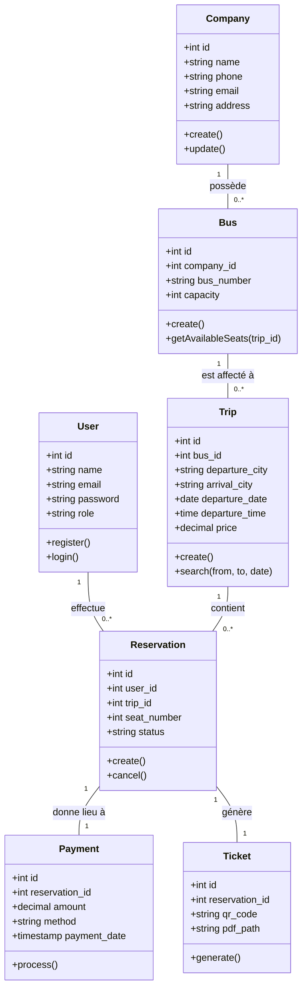
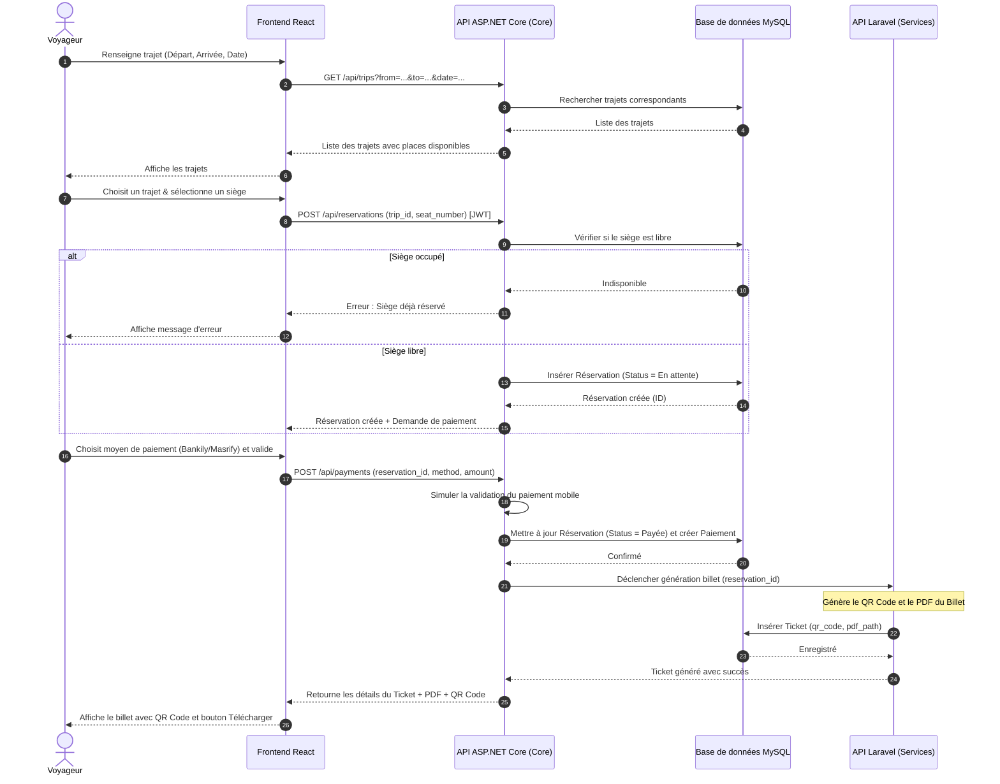
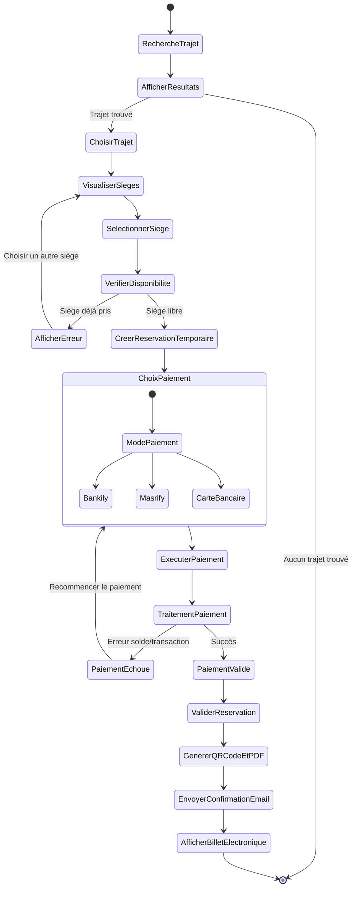
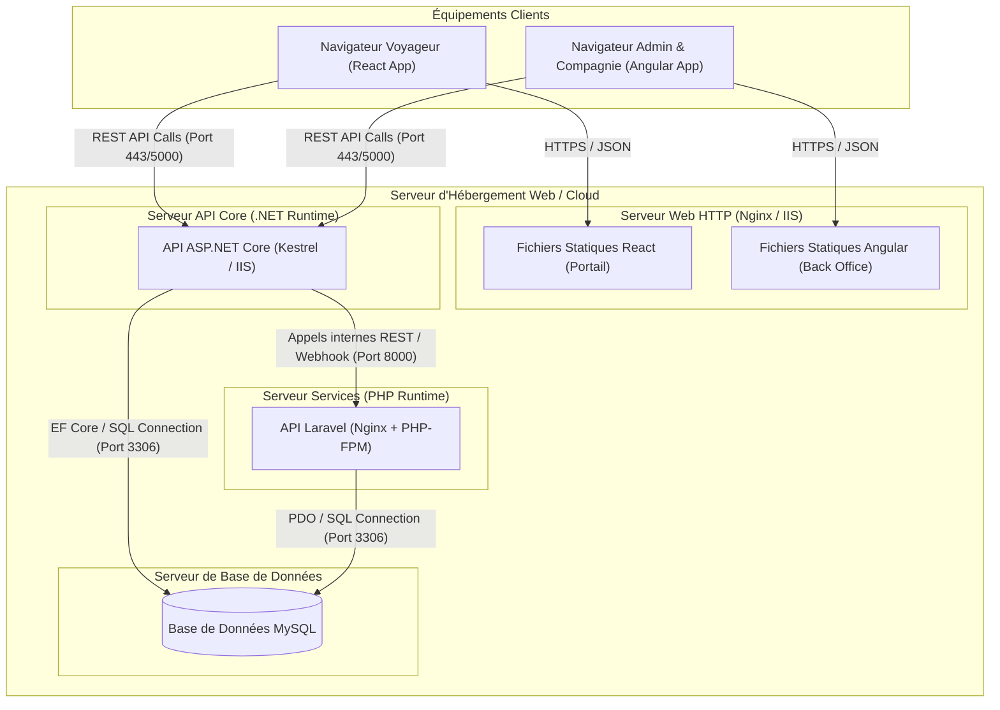

# Conception UML - Plateforme de Gestion du Transport Interurbain en Mauritanie

Ce document présente la modélisation UML complète du système de gestion des transports.

---

## 1. Diagramme de Cas d'Utilisation (Use Case Diagram)

Ce diagramme décrit les interactions entre les différents acteurs (Voyageur, Compagnie, Administrateur) et le système.

```mermaid
leftToRightDirection
actor Voyageur
actor "Compagnie de Transport" as Compagnie
actor Administrateur

rectangle "Plateforme de Transport Interurbain" {
  usecase "S'authentifier (Connexion/Inscription)" as UC_Auth
  
  usecase "Rechercher un trajet" as UC_Search
  usecase "Sélectionner un siège" as UC_Seat
  usecase "Réserver et Payer (Bankily/Masrify/CB)" as UC_Pay
  usecase "Télécharger le billet QR Code" as UC_Ticket
  
  usecase "Gérer la flotte de bus" as UC_Bus
  usecase "Planifier des trajets" as UC_Trip
  usecase "Consulter les réservations & Passagers" as UC_ViewRes
  usecase "Valider un billet (Scan QR Code)" as UC_Scan
  
  usecase "Gérer les comptes compagnies" as UC_ManageComp
  usecase "Consulter les statistiques globales" as UC_Stats
}

Voyageur --> UC_Auth
Voyageur --> UC_Search
Voyageur --> UC_Seat
Voyageur --> UC_Pay
Voyageur --> UC_Ticket

Compagnie --> UC_Auth
Compagnie --> UC_Bus
Compagnie --> UC_Trip
Compagnie --> UC_ViewRes
Compagnie --> UC_Scan

Administrateur --> UC_Auth
Administrateur --> UC_ManageComp
Administrateur --> UC_Stats
```

---

## 2. Diagramme de Classes (Class Diagram)

Ce diagramme définit la structure des données, les attributs des entités et leurs relations/cardinalités.



---

## 3. Diagramme de Séquence (Sequence Diagram)

Ce diagramme montre le flux d'interactions lors du processus de recherche, sélection de siège, réservation, paiement et génération de billet.



---

## 4. Diagramme d'Activités (Activity Diagram)

Ce diagramme détaille le flux d'activités pour réserver et acheter un billet.



---

## 5. Diagramme de Déploiement (Deployment Diagram)

Ce diagramme montre la topologie physique du système et la répartition des applications sur l'infrastructure d'hébergement.


